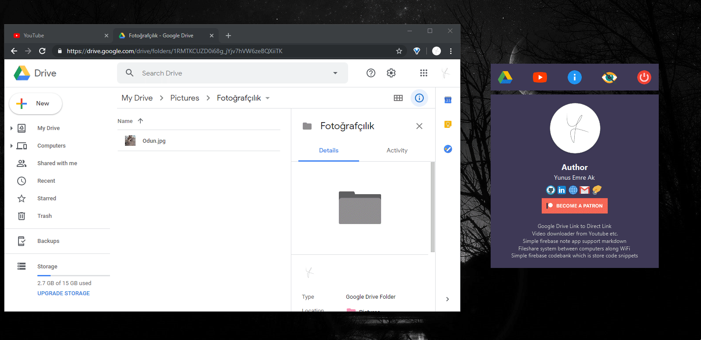
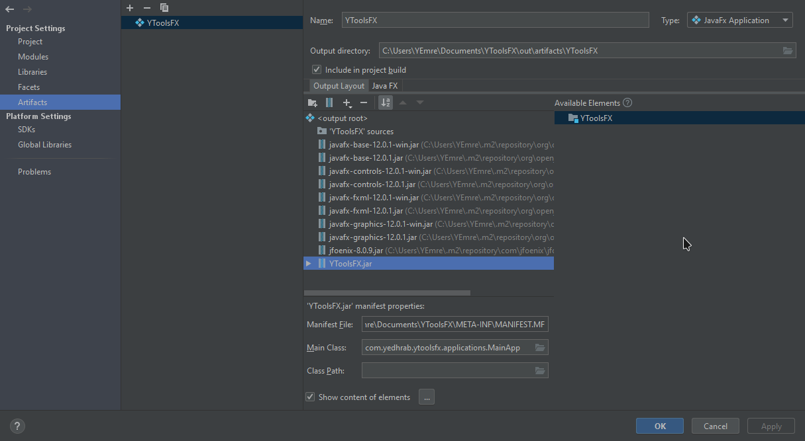
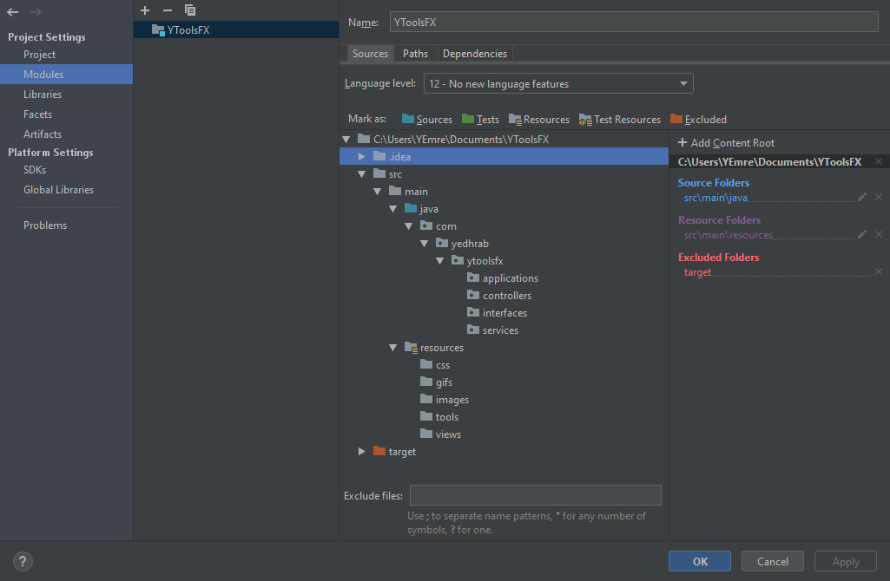
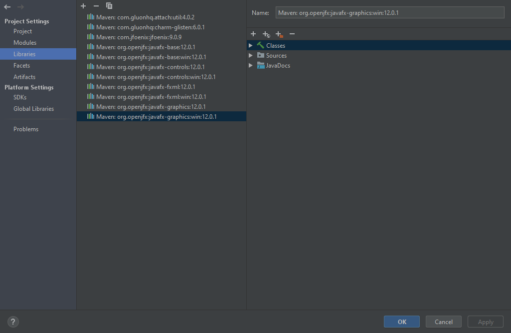
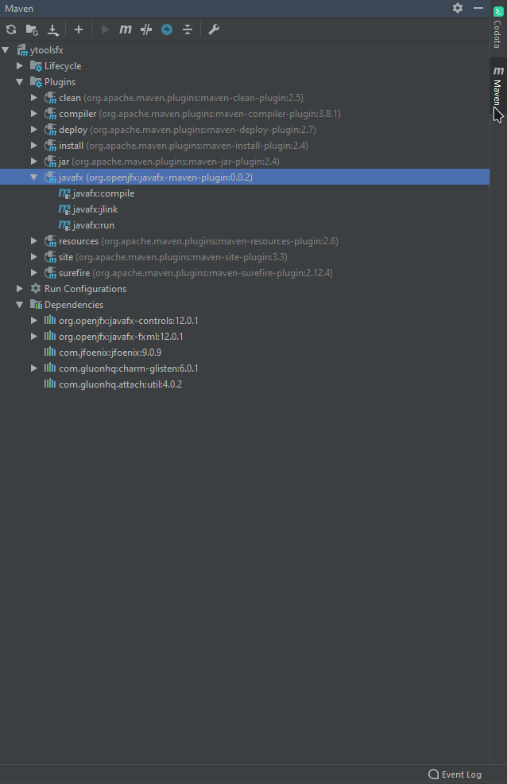

# YToolsFX <!-- omit in toc -->

Kişisel araçlarımı derlediğin JavaFX GUI'si.

> Java 12'nin son sürümü ile yazılmıştır, JDK 8 ile deploy edilmiştir. ([buradan](https://github.com/yedhrab/YToolsFX/releases/download/1.0.0/YToolsFX.rar) veya [release](https://github.com/yedhrab/YToolsFX/releases) sayfasından indirebilirsin)

## İçerikler <!-- omit in toc -->

- [Tanıtım](#Tan%C4%B1t%C4%B1m)
- [Hazırlanma](#Haz%C4%B1rlanma)
  - [Java8 için Hazırlama](#Java8-i%C3%A7in-Haz%C4%B1rlama)
  - [Java8 ile Dışarı aktarma (Deploy)](#Java8-ile-D%C4%B1%C5%9Far%C4%B1-aktarma-Deploy)
  - [Java12 Ayarları](#Java12-Ayarlar%C4%B1)
  - [Dosyaları Yapılandırma](#Dosyalar%C4%B1-Yap%C4%B1land%C4%B1rma)
  - [Bağımlılıkları Dahil Etme](#Ba%C4%9F%C4%B1ml%C4%B1l%C4%B1klar%C4%B1-Dahil-Etme)
  - [Maven Yapısı](#Maven-Yap%C4%B1s%C4%B1)
  - [Scene Builder ile Tasarım Ayarı](#Scene-Builder-ile-Tasar%C4%B1m-Ayar%C4%B1)
  - [Derleme Yapılandırması](#Derleme-Yap%C4%B1land%C4%B1rmas%C4%B1)
    - [Maven Derleme Paneli](#Maven-Derleme-Paneli)
- [Ek Scriptler](#Ek-Scriptler)
- [Destek ve İletişim](#Destek-ve-%C4%B0leti%C5%9Fim)

## Tanıtım

- Google drive direct link oluşturma
  - Direct link, tıkladığınız anda indirelebilen linklerdir
- Youtube üzerinden video / ses indirme
  - Videoları `Downloads` dizinine kaydeder.

[](res/app.mp4)

## Hazırlanma

<kbd>Project Structures</kbd> kısmına erişme kısayolu: <kbd>CTRL</kbd> + <kbd>ALT</kbd> + <kbd>SHIFT</kbd> + <kbd>S</kbd>

> - Test için otomatize edilemsi lazım 😢
> - Her panelin `fxml` dosyası ayrılıp ana `fxml`'e node olarak include edilecek (her fxml tek controller kabul ediyor 😢)

### Java8 için Hazırlama

Direct olarak exe'yi **artifact** kısmından oluşturabilrisin

- **Project SDK** `1.8 (java version 1.8.0_212)`
- **Project Language Level** - `8`
- **Project compiler output** `~\YToolsJava\out`
- **Modules** sekmesinden **Dependencies**, **Module SDK** `1.8`

### Java8 ile Dışarı aktarma (Deploy)

<kbd>Project Structures</kbd> + <kbd>Artifact</kbd> + <kbd>+</kbd> + <kbd>JavaFX Application</kbd>

- `JavaFX` sekmesine gelin
- Tüm **available elements** verilerini `YToolsFX sources` alanına ekleyin
- Manifest dosyası `src` altındadır
- MainApp yolu `com.yedhrab.ytoolsfx.applications.MainApp`
- **Application Class** kısmından Main methodunuzu seçin (Application'ı extend etmeli)
- **Native Bundle**'dan istediğinizi seçin (olmazsa `all` deyin)

> [Buradan](https://www.youtube.com/watch?v=iR85RRep-Po&t=299s) deploy etmeye bakabilrisin



### Java12 Ayarları

<kbd>Project Structure</kbd> - <kbd>Project</kbd> alanına girin

- **Project SDK** `java version 12.0.1`
- **Project Language Level** - `12`
- **Project compiler output** `~\YToolsJava\out`

> Java 12 ile `exe` oluşturulması basit değil 😢
>
> - [JavaFX 12 exe oluşturma](https://medium.com/@adam_carroll/java-packager-with-jdk11-31b3d620f4a8)
> - [Stackoverflow Sorusu](https://stackoverflow.com/questions/53453212/how-to-deploy-a-javafx-11-desktop-application-with-a-jre)

### Dosyaları Yapılandırma

<kbd>Project Structure</kbd> - <kbd>Project Settings</kbd> - <kbd>Modules</kbd> - <kbd>Source</kbd> sekmesinde alttaki gibi ayarlayın



> Kaynak için [buraya](https://openjfx.io/openjfx-docs/#install-javafx) bakabilirsin.

### Bağımlılıkları Dahil Etme

Proje [JavaFX] ve [JFoenix] framework'ü ve [Gluonhq charm-glisten] modülü ile yapılmıştır.

- `pom.xml` dosyasında tüm modülleri indirin
- Video indirme aracı olan [youtube-dl]'i kurun

> Youtube indirici için [youtube-dl]'in gerek duyduğu [Microsoft Visual C++ 2010 Redistributable Package (x86)](https://download.microsoft.com/download/5/B/C/5BC5DBB3-652D-4DCE-B14A-475AB85EEF6E/vcredist_x86.exe) paketi gereklidir.

### Maven Yapısı



### Scene Builder ile Tasarım Ayarı

[JFoenix] framework'ü kullanıldığından [Scene Builder]'ın library'lerine dahil edilmesi lazımdır.

- Sol üst kısımda **Library** sekmesinin en sağındaki <kbd>⚙</kbd> tıklayın
- <kbd>JAR/FXML Management</kbd> - <kbd>Add Library/FXML from file system</kbd> linkine tıklayın
- İndirdiğiniz [JFoenix] dosyasının `jar`'ını bulup, seçin.
- <kbd>Check All</kbd> ve <kbd>Built in</kbd> ayarları ile dahil edin.

### Derleme Yapılandırması

**Run/Debug configuration** (ya da edit configuration) alanına girin

- <kbd>+</kbd>'ya basıp <kbd>Maven</kbd> yazısına tıklayın
- **Command Line** alanına `javafx:run` yazın
- **Before launch: Activate Tool Window** alanından
- <kbd>+</kbd> + <kbd>Run Maven Goal</kbd>
  - **Command Line** kısmına `javafx:compile` yazın

#### Maven Derleme Paneli

Sağ kenardaki panelde yer alan **Mavem** yazısına basar maven ile derleme panelini açabilirsin.

> Uygulamamız javafx olduğundan, _Plugins/javafx_ alanındaki derleme eylemlerini kullanabilirsin



## Ek Scriptler

> Gerekli değildir, hiç kafa yormayın 😅

```bat
set PATH_TO_FX_MODS=C:\Program Files\Java\javafx-jmods-12.0.1
set JAVA_HOME=C:\Program Files\Java\jdk-12.0.1
set PATH_TO_JDK_FX=C:\Program Files\Java\jdkfx-12.0.1
"%JAVA_HOME%\bin\jlink" --module-path "%PATH_TO_FX_MODS%" --add-modules java.se,javafx.fxml,javafx.web,javafx.media,javafx.swing --bind-services --output "%PATH_TO_JDK_FX%"

javac --module-path "%PATH_TO_FX_MODS%" --add-modules java.se,javafx.fxml,javafx.web,javafx.media,javafx.swing --bind-services --output "%PATH_TO_JDK_FX%"

set JAVA_HOME=%PATH_TO_JDK_FX%

dir /s /b src\*.java > sources.txt & javac -d mods/hellofx @sources.txt & del sources.txt
java --module-path mods -m hellofx/hellofx.HelloFX

javac --module-path "%PATH_TO_FX_MODS%" --add-modules java.se,javafx.fxml,javafx.web,javafx.media,javafx.swing -d out/ytoolsfx @sources.txt

java --module-path "%PATH_TO_FX_MODS%" --add-modules java.se,javafx.fxml,javafx.web,javafx.media,javafx.swing -d out/ytoolsfx @sources.txt

java --module-path out -m hellofx/hellofx.HelloFX

dir /s /b *.class > sources.txt
```

## 💖 Destek ve İletişim

​[​​](https://github.com/yedhrab) [​​](https://www.linkedin.com/in/yemreak/) [​​](https://yemreak.com/) [​​](mailto::yedhrab@gmail.com?subject=YToolsFX%20%7C%20Github)​

​[​](https://www.patreon.com/yemreak/)

## 🔏 Lisans

**The** [**Apache 2.0 License**](https://choosealicense.com/licenses/apache-2.0/) **©️ Yunus Emre Ak**


